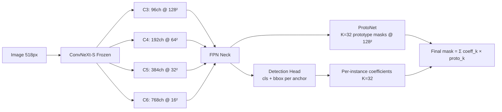

# YOLO-Style Instance Segmentation with Better Backbone

## Problem Statement

Query-based decoders (Mask2Former-style) require Hungarian matching, produce classification lag (masks converge faster than class predictions), and need careful loss weight tuning. YOLO-seg avoids all these issues with a prototype-based approach — but uses a small CSPDarknet backbone (~25M params).

**Goal**: Combine a stronger backbone with YOLO-style prototype mask prediction.

## Backbone Selection

| Backbone | Params | ImageNet Top-1 | COCO Mask AP | Multi-Scale | Speed |
|----------|--------|----------------|-------------|-------------|-------|
| CSPDarknet (YOLO) | ~25M | ~78% | ~36% | Via PAN | Very fast |
| **ConvNeXt-S** | **50M** | **83.1%** | **41-42%** | Hierarchical | Fast |
| Swin-T | 28M | 81.3% | 39-40% | Native | Medium |
| ConvNeXt-B | 89M | 83.8% | 42-43% | Hierarchical | Medium |
| DINOv2-L (current) | 304M | 86% | N/A | Single-scale | Slow |

> [!IMPORTANT]
> **Recommendation: ConvNeXt-Small** — 2× CSPDarknet capacity, +5% ImageNet accuracy, proven for dense prediction. Available pretrained via `torchvision.models.convnext_small(weights="IMAGENET1K_V1")`.

## Architecture: Prototype-Based Masks (YOLACT-style)

Instead of query-based prediction, use YOLO/YOLACT's prototype approach:



### How it works

**Step 1: ProtoNet** generates K=32 global mask templates from FPN features:
```
ProtoNet(P3) → [B, 32, 128, 128]  (32 prototype masks)
```

**Step 2: Detection head** predicts per-anchor: `[class_scores, bbox, 32 mask_coefficients]`

**Step 3: Final mask** = linear combination of prototypes, cropped to bbox:
```python
mask_i = sigmoid(sum(coeff_i_k * proto_k for k in range(32)))
mask_i = crop_to_bbox(mask_i, bbox_i)
```

### Why this is better than query-based

| Issue | Query-Based | Prototype-Based |
|-------|-------------|-----------------|
| **Assignment** | Hungarian matching (complex, CPU sync) | Grid/anchor IoU (simple, GPU-native) |
| **Classification** | Lags behind masks (weak signal) | Dense per-cell supervision (strong signal) |
| **Loss balancing** | Manual weight tuning critical | Less sensitive (bbox anchors the training) |
| **Training stability** | Query collapse risk | Stable (prototypes are global, coefficients are local) |
| **Training speed** | Slow (attention, matching) | Fast (all convolutions) |

## Loss Function

```
L_total = λ_box × L_CIoU + λ_cls × L_BCE + λ_mask × L_BCE_mask

Default weights: λ_box=7.5, λ_cls=0.5, λ_mask=1.0
```

No dice loss needed — the bbox regression anchors the spatial learning, and mask BCE handles pixel-level supervision within the bbox crop.

## Training Comparison (Expected)

| | DINOv2 + Query (current) | ConvNeXt-S + Prototypes |
|---|---|---|
| Backbone | 304M frozen | 50M frozen |
| Trainable | 7.6M | ~5M |
| Image size | 518px | 512px |
| Batch size | 4 | 8-16 |
| Speed | ~0.8s/it | ~0.2s/it (est.) |
| Epoch time | ~1.5h | ~20min (est.) |
| Classification | Lags masks | Trains jointly |

## Implementation Options

### Option A: Build from scratch
- ConvNeXt-S backbone + FPN neck + detection head + ProtoNet
- Most work, but full control

### Option B: Use Ultralytics with ConvNeXt
- Replace YOLO's CSPDarknet with ConvNeXt-S
- Leverage Ultralytics training pipeline (proven, optimized)
- Less code, faster iteration

### Option C: Use mmdetection with ConvNeXt + YOLACT/SOLOv2
- Battle-tested framework
- ConvNeXt backbone + YOLACT head = well-supported combo
- Best for research-quality results

## Next Steps

1. Decide which implementation path (A/B/C)
2. If Option A: implement ConvNeXt backbone wrapper + FPN + ProtoNet
3. If Option B/C: configure and fine-tune existing framework
