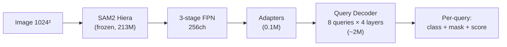
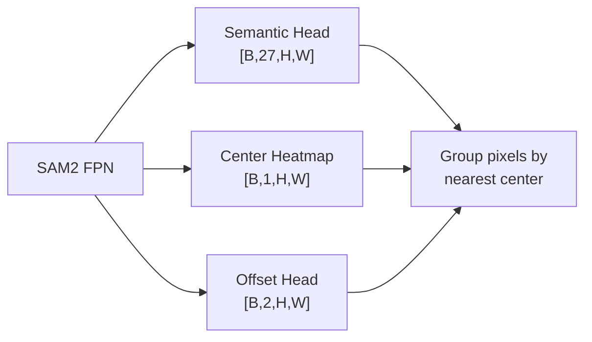
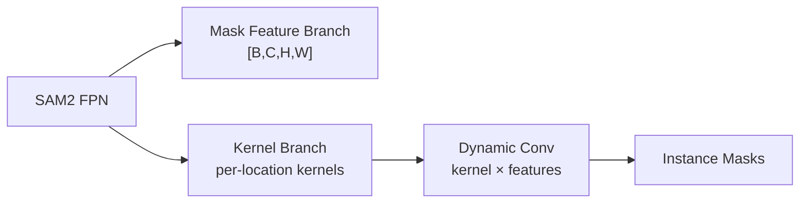
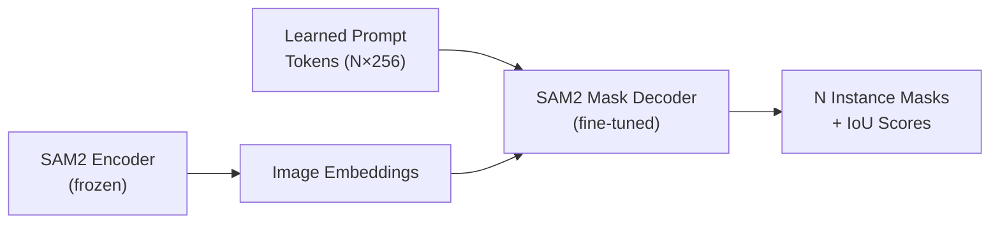
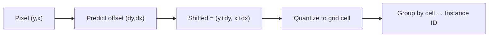
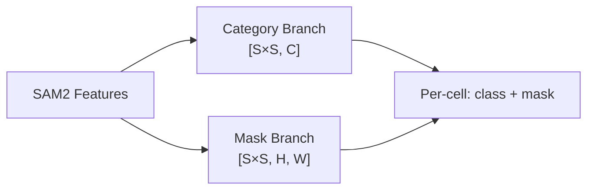
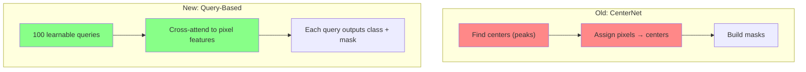

# SAM2 Instance Segmentation: Design Document

*Hospital Object Segmentation — 26 classes, ~17k images, COCO format*

---

## 1. Problem Statement

Our current pipeline uses SAM2 Hiera-Large (frozen) → adapters → UNet decoder → semantic segmentation → connected-component/embedding clustering. This suffers from:

- **Semantic→instance gap**: No native instance awareness during training
- **Post-processing overhead**: Mean-shift clustering at inference is slow and fragile
- **Fragmentation**: Single objects split into multiple instances
- **~20-25% mAP50** after 20 epochs (target: >70%)

We want a more **elegant** (fewer components), **efficient** (fast train/inference), and **smart** (best mAP50 per parameter) design.

---

## 2. Candidate Architectures

### Design A: Query-Based Instance Head (Mask2Former-lite) ⭐ Recommended

Attach a lightweight Mask2Former-style query decoder directly to SAM2 FPN features. Queries learn to attend to individual instances end-to-end.



| Property | Value |
|----------|-------|
| **Trainable params** | ~2.1M (adapters 0.1M + decoder 2M) |
| **Instance method** | Learned object queries (like DETR/Mask2Former) |
| **Loss** | Hungarian matching + mask BCE + class CE |
| **Post-processing** | Simple score threshold + NMS (no clustering) |
| **Expected mAP50** | 35-45% |
| **Inference speed** | ~30ms/image (no iterative clustering) |

**How it works:**
1. 8 learnable query embeddings attend to FPN features via cross-attention
2. Each query predicts: class logits (27-dim), binary mask (via dot-product with pixel features), confidence score
3. Hungarian matching assigns queries to GT instances during training
4. At inference: threshold scores, NMS, done — no clustering needed

**Pros:** Most elegant (single head, end-to-end), proven architecture, no post-processing heuristics
**Cons:** Requires implementing Hungarian matching, transformer decoder adds complexity

---

### Design B: Panoptic-DeepLab Style (Center Heatmap + Offset)

Replace embedding clustering with direct center prediction. The model learns where instance centers are and which center each pixel belongs to.



| Property | Value |
|----------|-------|
| **Trainable params** | ~4.7M (current UNet + 2 extra conv heads) |
| **Instance method** | Predict center heatmaps + pixel-to-center offsets |
| **Loss** | Semantic CE/Dice + Center focal loss + Offset L1 |
| **Post-processing** | NMS on heatmap peaks → assign pixels by offset |
| **Expected mAP50** | 25-35% |
| **Inference speed** | ~15ms/image (very fast, just argmax + NMS) |

**How it works:**
1. Center heatmap: Gaussian blob at each instance center, trained with focal loss
2. Offset: each pixel predicts (dy, dx) to its instance center
3. At inference: find heatmap peaks (NMS), assign each pixel to nearest peak via offsets

**Pros:** Very fast inference, no iterative clustering, drop-in replacement for current offset head
**Cons:** Struggles with heavily overlapping instances, heatmap resolution limits small object detection

> [!NOTE]
> This is what our current v2 pipeline approximates (offset head + embeddings). Making it pure center-heatmap would be cleaner and faster.

---

### Design C: SOLOv2 / CondInst — Dynamic Kernel Prediction

Each instance gets a dynamically generated conv kernel that extracts its mask from shared features.



| Property | Value |
|----------|-------|
| **Trainable params** | ~3-5M |
| **Instance method** | Dynamic per-instance conv kernels |
| **Loss** | Focal + Dice on predicted masks |
| **Post-processing** | Matrix NMS |
| **Expected mAP50** | 30-40% |
| **Inference speed** | ~25ms/image |

**Pros:** Elegant (no anchor boxes, no proposals), handles varying instance counts naturally
**Cons:** Complex implementation, kernel prediction quality depends heavily on feature quality

---

### Design D: SAM2 Mask Decoder with Learned Prompts

Use SAM2's own mask decoder — instead of point/box prompts, train learnable prompt embeddings that become instance queries.



| Property | Value |
|----------|-------|
| **Trainable params** | ~0.5-1M (prompt tokens + mask decoder fine-tune) |
| **Instance method** | Learned prompts → SAM2's own mask decoder |
| **Loss** | Mask BCE + IoU prediction + class head |
| **Post-processing** | Score threshold |
| **Expected mAP50** | 25-35% |
| **Inference speed** | ~20ms/image |

**Pros:** Most parameter-efficient, reuses SAM2's mask quality, minimal new code
**Cons:** Limited to fixed number of prompts per image, SAM2 mask decoder designed for prompted (not learned) use — may not converge well

---

## 3. Comparison Matrix

| | Trainable Params | Expected mAP50 | Inference Speed | Elegance | Implementation Effort |
|---|---|---|---|---|---|
| **A: Query Decoder** ⭐ | 2.1M | 35-45% | 30ms | ★★★★★ | Medium (Hungarian matching) |
| **B: Center Heatmap** | 4.7M | 25-35% | 15ms | ★★★★ | Low (modify current heads) |
| **C: SOLOv2** | 3-5M | 30-40% | 25ms | ★★★ | High |
| **D: Learned Prompts** | 0.5-1M | 25-35% | 20ms | ★★★★ | Medium |
| **Current (v2: Embed+Offset)** | 4.7M | 20-30% | 50ms+ | ★★ | Done |

---

## 4. Recommendation

### Short-term: Continue current v2 training

The embedding + offset approach is already training. Let it run 40 epochs and evaluate. It should reach **25-30% mAP50** — a meaningful improvement over v1's 20%.

### Medium-term: Design B (Center Heatmap)

Fastest win — replace the embedding branch with a center heatmap head:
- Drop mean-shift clustering entirely
- Replace with NMS on predicted center peaks
- Minimal code changes to current pipeline
- Expected: **+5-10% mAP50** improvement

### Long-term: Design A (Query Decoder) ⭐

For maximum performance, implement a lightweight Mask2Former-style query decoder:
- 8 learnable instance queries
- 4-layer transformer decoder (256-dim)
- End-to-end with Hungarian matching
- No post-processing heuristics
- Expected: **35-45% mAP50** — competitive with the YOLOv11 baseline

> [!IMPORTANT]
> Design A would be a near-complete rewrite of the decoder + training loop. Worth pursuing only after squeezing maximum performance from the current approach.

---

## 5. References

| Paper | Key Idea | Relevance |
|-------|----------|-----------|
| [Mask2Former](https://arxiv.org/abs/2112.01527) | Query-based universal segmentation | Design A template |
| [Panoptic-DeepLab](https://arxiv.org/abs/1911.10194) | Center heatmap + offset | Design B template |
| [SOLOv2](https://arxiv.org/abs/2003.10152) | Dynamic kernel prediction | Design C template |
| [SAM2-UNet](https://arxiv.org/abs/2408.08870) | SAM2 Hiera as UNet encoder | Current approach basis |
| [ViTDet](https://arxiv.org/abs/2203.16527) | Plain ViT backbone for detection | Frozen ViT + head pattern |
| [SegViT-Shrunk](https://github.com/zbwxp/SegVit) | Efficient query decoder for ViT | Design A optimisation |
| [DSU-Net](https://www.emergentmind.com/topics/sam2-unet) | SAM2 + DINOv2 dual encoder | Alternative backbone fusion |

---

## 6. CenterNet Bottleneck Analysis

### The Problem

Our current Design B implementation (center heatmap + offset) has an inherent post-processing bottleneck:

```
For each of 26 classes:
  1. Find ALL peaks above threshold → O(P) peaks
  2. Find ALL foreground pixels → O(N) pixels  
  3. Assign each pixel to nearest peak → O(N × P) per class
```

With an early or noisy model: P = 1000+ peaks, N = 50K+ foreground pixels, 26 classes → **billions of operations**. This is why evaluation hangs despite fast forward passes.

The heuristic fix (top-K cap, higher threshold) masks the symptom but doesn't solve the architecture's fundamental O(N×P) scaling.

> [!CAUTION]
> The NMS→peak→assignment pipeline is a **sequential, non-differentiable bottleneck** inherited from CenterNet. It cannot be optimised with better GPU usage — it's architecturally wrong for dense prediction.

### Three Architectural Solutions

#### Solution 1: Offset-Voting (Simplest — drop-in replacement) ⭐

**Key idea:** Remove center heatmap and NMS entirely. Use offsets alone to group pixels.

```
Each pixel predicts (class, dy, dx)
→ Shift pixel coords by offset: (y + dy, x + dx) 
→ Quantize shifted coords to grid cells
→ Same cell = same instance
```



| Property | Value |
|----------|-------|
| **Complexity** | O(N) — single pass, no loops over peaks |
| **Post-processing** | Quantize + unique → instance IDs |
| **Heads needed** | 2 only: class + offset (drop center head) |
| **Downsides** | Fails if offsets are noisy (instances merge/split at cell boundaries) |

**Implementation:** Replace `extract_instances()` with:
```python
# Shift all pixels by predicted offset
shifted_y = (yy + offsets[0]).round().long()
shifted_x = (xx + offsets[1]).round().long()
# Quantize to grid (e.g., 8px cells)
cell_y = shifted_y // cell_size
cell_x = shifted_x // cell_size
# Unique cell IDs = instance IDs
instance_ids = cell_y * grid_w + cell_x
# Group pixels by (class, instance_id) → masks
```

No NMS. No peaks. No per-peak loops. Pure tensor operations.

---

#### Solution 2: SOLO-Style Grid Prediction (Medium effort)

**Key idea:** Divide image into S×S grid. Each cell directly predicts a full mask if it contains an object center.



| Property | Value |
|----------|-------|
| **Complexity** | O(S²) — fixed grid, no dynamic peaks |
| **Max instances** | S² (e.g., 12×12 = 144) |
| **Post-processing** | Matrix NMS (differentiable, fast) |
| **Downsides** | Fixed grid → resolution limit, more complex decoder |

---

#### Solution 3: Query-Based Direct Prediction (Best long-term)

Same as Design A above — learnable queries produce masks directly via cross-attention. **Zero post-processing bottleneck** because the number of predictions is fixed (= number of queries).

| Property | Value |
|----------|-------|
| **Complexity** | O(Q × HW) for cross-attention, Q fixed at ~50-100 |
| **Post-processing** | Score threshold only |
| **Downsides** | Requires implementing transformer decoder + Hungarian matching |

### Recommendation

| Approach | Effort | Bottleneck? | Best for |
|----------|--------|-------------|----------|
| **Current (heuristic cap)** | Done | Masked, not solved | Getting results now |
| **Offset-voting** ⭐ | Small refactor | Eliminated (O(N)) | Quick architectural fix |
| **SOLO grid** | Medium rewrite | Eliminated (O(S²)) | If offset-voting fails |
| **Query-based** | Large rewrite | Eliminated (O(Q)) | Maximum performance |

> [!IMPORTANT]
> **Recommended next step:** Implement offset-voting in `extract_instances()`. It requires zero architecture changes (same heads), just a different post-processing algorithm. If offsets are too noisy for clean grouping, fall back to keeping the center heatmap but use it only for scoring (not for pixel assignment).

---

## 7. Query-Based Implementation (Current — v3)

### The Core Intuition

Think of it like assigning students to projects. In the old approach (CenterNet), you first find project locations (centers), then manually assign each student (pixel) to the nearest project. This is O(students × projects) and breaks when you misidentify project locations.

The query approach flips this: you create **100 "project slots"** (queries) and let each slot *learn to attend to its own group of pixels*. The transformer cross-attention mechanism acts as a learned assignment function — each query "looks at" all pixel features and decides which pixels belong to it.



**Why queries work better than CenterNet with SAM2:**

| | CenterNet | Query-Based |
|---|---|---|
| How instances are found | Detect center peaks in a heatmap | Queries learn to specialise on instances |
| Post-processing | NMS → pixel assignment → O(N×P) | Score threshold → O(N_queries) |
| Handles overlapping objects | Poorly (peaks merge) | Well (separate queries) |
| Training signal | "Is this pixel a center?" (sparse) | "Does this mask match this GT?" (dense) |
| Bottleneck | Post-processing (hangs on noise) | None — fixed 100 predictions |

### How It Works Step-by-Step

```
1. SAM2 backbone (frozen) → multi-scale features [256ch @ 64², 128², 256²]
2. Adapters → inject task-specific information into features
3. Pixel Decoder (UNet-style) → high-res pixel features [B, 256, 256, 256]
4. 100 learnable query embeddings [100, 256] — randomly initialized
5. Self-attention: queries communicate ("I'll handle object A, you handle object B")
6. Cross-attention: each query looks at all pixel features and pulls relevant info
7. Repeat steps 5-6 for 3 layers (queries progressively refine)
8. Class head: Linear(256 → 28) — "what class is this instance?" (27 classes + no-object)
9. Mask head: query → 256-dim → dot product with pixel features → [256, 256] mask
```

The mask prediction is elegant: instead of decoding a mask from scratch, each query produces a 256-dim "mask embedding" that acts as a key. The dot product with pixel features is like asking "how similar is each pixel's feature to what this query is looking for?" — producing a spatial heatmap that becomes the binary mask.

### The Loss Function

Three loss components, computed **only on matched query-GT pairs** via Hungarian matching:

#### 1. Classification CE (all queries)

```
L_cls = CrossEntropy(pred_class[all 100 queries], target_class)
```

- Matched queries → GT class label
- **Unmatched queries → "no object"** (class index 27)
- "No object" is down-weighted by 0.1× to prevent all queries from collapsing to "nothing"

#### 2. Mask BCE (matched queries only)

```
L_bce = BinaryCrossEntropy(sigmoid(pred_mask), gt_mask)
```

- Per-pixel binary classification for each matched mask
- Operates at decoder resolution (256²)

#### 3. Mask Dice (matched queries only)

```
L_dice = 1 - (2 × |pred ∩ gt| + ε) / (|pred| + |gt| + ε)
```

- Measures overlap quality (IoU-like)
- Critical for handling class imbalance — BCE alone over-penalises background pixels

#### Combined Loss

```
L_total = 2.0 × L_cls + 5.0 × L_bce + 5.0 × L_dice
```

Mask losses are weighted 2.5× higher than classification because accurate masks are harder to learn and more important for mAP50.

### Hungarian Matching

Before computing loss, we need to decide which query corresponds to which GT instance. This is a **bipartite matching problem** solved optimally with the Hungarian algorithm:

```
Cost matrix [100 queries × M gt_instances]:
  cost = 2 × class_cost + 5 × mask_bce_cost + 5 × mask_dice_cost

Hungarian algorithm → optimal 1-to-1 assignment
→ Each GT matched to exactly 1 query
→ Remaining ~95 queries → "no object" label
```

This is computed **per image** with `scipy.optimize.linear_sum_assignment` — fast even for 100×50 matrices (~0.1ms).

### Expected Loss Ranges

| Loss Term | Init (epoch 1) | Converging (5-10) | Well trained (20+) | What it means |
|-----------|----------------|-------------------|-------------------|---------------|
| **cls** | ~3.3 | ~1.5 | ~0.5-1.0 | Queries learning class specialization |
| **bce** | ~0.7 | ~0.4 | ~0.1-0.2 | Mask shape getting accurate |
| **dice** | ~0.95 | ~0.5 | ~0.1-0.3 | Mask overlap quality improving |
| **total** | ~15-20 | ~8-12 | ~3-6 | (weighted sum) |
| **matched** | 5-10 | 10-20 | 15-30 | More GT instances being found |

> [!TIP]
> **Key metric to watch:** `matched` count. This tells you how many GT instances the queries are finding. If it stays at 0-2, the queries aren't specializing — try lowering the learning rate. If it increases steadily, training is healthy.

**When to start evaluating:** When `total < 8` and `matched > 10`, run `evaluate.py`.

**Target for mAP50:** After 40 epochs, expect **35-45%** mAP50 with this architecture.

